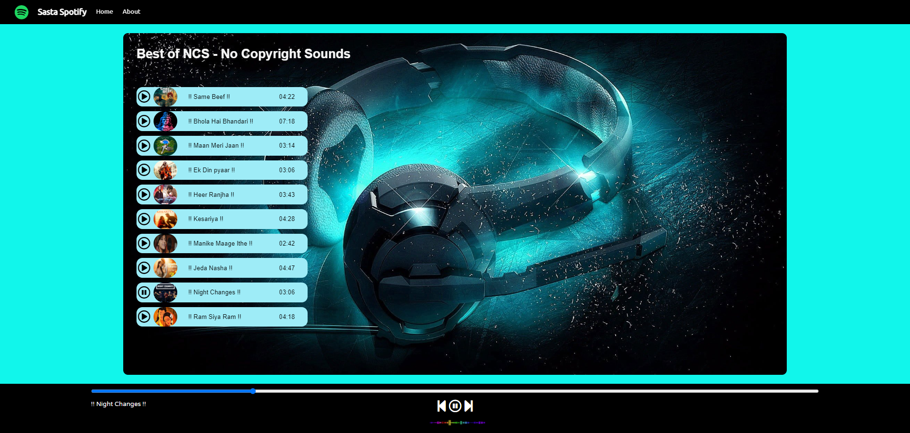

# Spotify Clone Website



This project is a simple Spotify Clone website built using HTML, CSS, and JavaScript. It allows users to play a curated list of songs and showcases the use of audio controls, dynamic song listings, and play/pause functionality.

## Table of Contents

- [Demo](#demo)
- [Features](#features)
- [Getting Started](#getting-started)
- [Usage](#usage)
- [Contributing](#contributing)
- [License](#license)

## Demo

You can see the live demo of the Spotify Clone Website [here](https://your-demo-link.com).

## Features

- Play and pause songs
- Switch between songs
- Dynamic song listing with cover art
- Progress bar to track song playback
- Responsive design for different screen sizes

## Getting Started

1. Clone this repository to your local machine:

```bash
git clone https://github.com/shreyasp-07/spotify-clone.git
```

2. Navigate to the project directory:

```bash
cd spotify-clone
```

3. Open the `index.html` file in your preferred web browser to view the website.

## Usage

- Click the play button to start playing a song.
- Click the pause button to pause the currently playing song.
- Use the next and previous buttons to switch between songs.
- Adjust the progress bar to seek through the song playback.

## Contributing

Contributions are welcome! If you find any issues or have suggestions for improvements, feel free to open an issue or submit a pull request.

1. Fork the repository.
2. Create a new branch for your feature/fix: `git checkout -b feature-name`
3. Make your changes and commit them: `git commit -m "Add new feature"`
4. Push to the branch: `git push origin feature-name`
5. Create a pull request detailing your changes.

